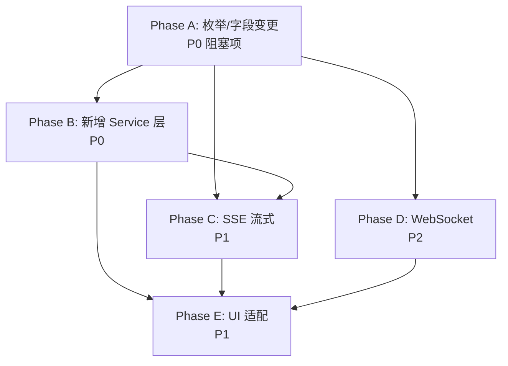

# VidNexus 前后端接口对齐开发计划（new.md 版）

> **生成日期**: 2026-05-23 | **依据**: `docs/API_INTEGRATION_PLAN new/new.md`（v2026-05-23-r2） | **当前状态**: Phase 7 已完成

---

## TL;DR

后端接口文档从 v2026-05-17 升级到 v2026-05-23-r2，新增了 **13 个 REST 端点**、WebSocket/SSE 实时协议、TUS 分片上传、设备注册（FCM），并变更了 `WorkflowState` 枚举（`DRAFT_READY` → `WAITING_USER_APPROVAL`）、新增 `presigned_url` 字段等。

本计划分 **5 个 Phase** 逐步对齐，预计总工时 **9-14 天**。

---

## 差距分析概览

| 类别 | 数量 | 说明 |
|------|------|------|
| 🆕 新增 REST 端点 | 13 | workflow 触发×2、附件上传×1、TUS 分片上传×5、设备管理×3、SSE 流×2 |
| 🔄 字段/枚举变更 | 5 | `DRAFT_READY`→`WAITING_USER_APPROVAL`、`presigned_url`×2、`chat_title`可选、错误模型 |
| 📡 新协议 | 2 | SSE (Server-Sent Events)、WebSocket `/ws/progress` |
| 📦 新 DTO | 10+ | StartAnalysis/ApproveAndFinalize/TimeTravelQAStream/TUS/Device/SSE/WSEvent 等 |
| 🖥️ UI 适配 | 3 | 审批按钮、附件选择、设备注册 |

---

## 新增端点明细

### 与旧文档（FRONTEND_BACKEND_API_INTERFACE_CN.md）对比新增的端点：

| # | 方法 | 路径 | 说明 |
|---|------|------|------|
| 1 | POST | `/api/v1/tasks/{task_id}/start-analysis` | 触发 Phase-1 分析工作流 |
| 2 | POST | `/api/v1/tasks/{task_id}/approve-and-finalize` | 触发 Phase-2 终稿生成 |
| 3 | POST | `/api/v1/tasks/{task_id}/time-travel-qa/stream` | 时间旅行 QA（SSE 流式） |
| 4 | POST | `/api/v1/kbs/{kbid}/chats/{chat_id}/qa/stream` | 全局 QA（SSE 流式） |
| 5 | POST | `/api/v1/attachments/upload` | 附件上传（multipart） |
| 6 | POST | `/api/v1/uploads` | TUS 上传初始化 |
| 7 | HEAD | `/api/v1/uploads/{upload_id}` | TUS 查询上传偏移 |
| 8 | PATCH | `/api/v1/uploads/{upload_id}` | TUS 上传分片 |
| 9 | DELETE | `/api/v1/uploads/{upload_id}` | TUS 取消上传 |
| 10 | GET | `/api/v1/uploads/{upload_id}` | TUS 上传状态 |
| 11 | POST | `/api/v1/devices` | 注册 FCM 设备 |
| 12 | DELETE | `/api/v1/devices/{device_token_id}` | 反注册 FCM 设备 |
| 13 | GET | `/api/v1/devices` | 列出已注册设备 |

### 已有端点字段变更：

| 端点 | 变更内容 |
|------|---------|
| `GET /api/v1/videos/{video_id}` | 响应新增 `presigned_url` 字段 |
| `GET /api/v1/tasks/{task_id}` | `workflow_state` 枚举：`DRAFT_READY` → `WAITING_USER_APPROVAL` |
| `POST /api/v1/kbs/{kbid}/chats` | `chat_title` 改为可选字段 |
| 所有 QA 相关响应 | `AttachmentInfo` 新增 `presigned_url`（响应专用） |

---

## Phase A: 枚举与字段变更（现有代码修复） ✅ 已完成

> 🎯 目标：无新功能，仅修正现有代码以匹配 new.md 的 schema 变更  
> ⏱ 实际：2026-05-23 完成  
> 📌 优先级：P0（阻塞所有后续 Phase）

### A1. WorkflowState 重命名 `DRAFT_READY` → `WAITING_USER_APPROVAL` ✅

**已修改文件：**
1. `lib/features/home/domain/video_summary_domain_models.dart` — 枚举定义 + fromApi + isTerminal + label
2. `lib/services/polling/task_poller.dart` — _mapStage/_mapMessage/_estimateProgress/_buildSteps + 注释
3. `lib/features/home/application/video_summary_session_history_controller.dart` — _stageFromWorkflowState 映射
4. `test/features/home/video_summary_http_repository_test.dart` — 所有断言和字符串

### A2. VideoResourceResponseData 新增 `presigned_url` 字段 ✅
### A3. AttachmentInfo 新增 `presigned_url` 字段 ✅
### A4. GlobalChatCreateRequest `chat_title` 改为可选 ✅
### A5. ApiError 增强兼容新 ErrorResponse 格式 ✅
### A6. ApiEndpoints 常量补齐 13 个新端点 ✅

### Phase A 验证结果

- [x] `flutter analyze --no-pub` — 仅 2 个预存 issue（非本次引入）
- [x] `flutter test` — 30/30 全部通过
- [x] `lib/` 下 `draftReady` / `DRAFT_READY` 零残留

---

## Phase B: 新增 Service 层（REST 端点对接） ✅ 已完成

> 🎯 目标：为 11 个新增 REST 端点创建 Service 方法和 DTO  
> ⏱ 实际：2026-05-23 完成  
> 📌 优先级：P0  
> 📎 依赖：Phase A 完成

### B1. TaskService 新增 Workflow 方法 ✅
- `startAnalysis(taskId)` → `POST /api/v1/tasks/{taskId}/start-analysis`
- `approveAndFinalize(taskId, ...)` → `POST /api/v1/tasks/{taskId}/approve-and-finalize`
- 新增 DTO：`StartAnalysisResponseData`、`ApproveAndFinalizeRequest`、`ApproveAndFinalizeResponseData`

### B2. 新建 AttachmentService ✅
- `uploadAttachment(filePath, fileName)` → `POST /api/v1/attachments/upload`
- DTO `AttachmentUploadResponseData` 内置于同文件

### B3. 新建 UploadService（TUS 分片上传） ✅
- `initUpload()` / `queryOffset()` / `uploadChunk()` / `cancelUpload()` / `getStatus()`
- 分片大小固定 10 MiB
- 独立 DTO 文件：`lib/services/models/upload_dto.dart`

### B4. 新建 DeviceService ✅
- `registerDevice()` / `unregisterDevice()` / `listDevices()`
- DTO `DeviceRegisterRequest` / `DeviceRegisterResponseData` 内置于同文件

### B5. Service Providers 注册 ✅
- `attachmentServiceProvider` / `uploadServiceProvider` / `deviceServiceProvider`

### 附加修改
- `ApiClient` 新增 `injectTestDio()` 方法（测试支持）

### Phase B 验证结果

- [x] `flutter analyze --no-pub` — 仅 2 个预存 issue
- [x] `flutter test test/features/` — **51/51 全部通过**（30 原有 + 13 新增 + 8 其他）
- [x] 新增 13 个测试覆盖：TaskService workflow×2、AttachmentService×1、UploadService TUS×4、DeviceService×3、DTO 序列化×3

---

## Phase C: SSE 流式协议支持（实时 QA 生成）

> 🎯 目标：替换 QA 场景的 HTTP 轮询为 SSE 流式推送  
> ⏱ 预估：2-3 天  
> 📌 优先级：P1  
> 📎 依赖：Phase A、Phase B（B1/C2/C3 需要 B1 的 endpoint 常量）

### C1. SSE 客户端基础能力

**新建文件**: `lib/services/sse/sse_client.dart`

- 基于 `dio` 的 `responseType: ResponseType.stream` 实现 SSE 解析
- 处理 `text/event-stream` 响应格式
- 事件类型枚举：`start` / `delta` / `done` / `error`
- 返回 `Stream<SSEEvent>`

**新建文件**: `lib/services/sse/sse_models.dart`

```dart
/// SSE 事件类型枚举。
enum SSEEventType { start, delta, done, error }

/// 通用 SSE 事件结构。
class SSEEvent {
  const SSEEvent({
    required this.type,
    this.data,
  });

  final SSEEventType type;
  final Map<String, dynamic>? data;

  /// 尝试将 data 解析为指定类型。
  T? parseData<T>(T Function(Map<String, dynamic>) fromJson) {
    if (data == null) return null;
    return fromJson(data!);
  }
}

/// POST /api/v1/tasks/{task_id}/time-travel-qa/stream 请求体。
class TimeTravelQAStreamRequest {
  const TimeTravelQAStreamRequest({
    required this.timestamp,
    required this.questionContent,
    this.attachments = const [],
    this.windowSeconds,
  });

  final String timestamp;        // 格式：HH:MM:SS
  final String questionContent;  // 也可传 question 别名
  final List<AttachmentInfo> attachments;
  final int? windowSeconds;     // 5~300，null=全量 RAG

  Map<String, dynamic> toJson() => {
        'timestamp': timestamp,
        'question_content': questionContent,
        'attachments': attachments.map((a) => a.toJson()).toList(),
        if (windowSeconds != null) 'window_seconds': windowSeconds,
      };
}

/// SSE start 事件的 data 载荷（time-travel QA）。
class TimeTravelQAStartData {
  const TimeTravelQAStartData({
    required this.taskId,
    required this.qaId,
    this.timestamp,
  });
  final String taskId;
  final String qaId;
  final String? timestamp;

  factory TimeTravelQAStartData.fromJson(Map<String, dynamic> json) =>
      TimeTravelQAStartData(
        taskId: json['task_id'] as String? ?? '',
        qaId: json['qa_id'] as String? ?? '',
        timestamp: json['timestamp'] as String?,
      );
}

/// SSE delta 事件的 data 载荷。
class SSE DeltaData {
  const SSEDeltaData({
    required this.taskId,
    required this.qaId,
    required this.chunk,
    required this.sequence,
    this.timestamp,
  });
  final String taskId;
  final String qaId;
  final String chunk;
  final int sequence;
  final String? timestamp;

  factory SSEDeltaData.fromJson(Map<String, dynamic> json) => SSEDeltaData(
        taskId: json['task_id'] as String? ?? '',
        qaId: json['qa_id'] as String? ?? '',
        chunk: json['chunk'] as String? ?? '',
        sequence: json['sequence'] as int? ?? 0,
        timestamp: json['timestamp'] as String?,
      );
}

/// SSE done 事件的 data 载荷。
class SSE DoneData {
  const SSEDoneData({
    required this.taskId,
    required this.qaId,
    this.answerContent,
    this.timestamp,
  });
  final String taskId;
  final String qaId;
  final String? answerContent;
  final String? timestamp;

  factory SSEDoneData.fromJson(Map<String, dynamic> json) => SSEDoneData(
        taskId: json['task_id'] as String? ?? '',
        qaId: json['qa_id'] as String? ?? '',
        answerContent: json['answer_content'] as String?,
        timestamp: json['timestamp'] as String?,
      );
}

/// Global QA 版本的 SSE 载荷。
class GlobalQAStartData {
  const GlobalQAStartData({
    required this.kbid,
    required this.chatId,
    required this.qaId,
    this.timestamp,
  });
  final String kbid;
  final String chatId;
  final String qaId;
  final String? timestamp;

  factory GlobalQAStartData.fromJson(Map<String, dynamic> json) =>
      GlobalQAStartData(
        kbid: json['kbid'] as String? ?? '',
        chatId: json['chat_id'] as String? ?? '',
        qaId: json['qa_id'] as String? ?? '',
        timestamp: json['timestamp'] as String?,
      );
}
```

### C2. VideoQAService 新增流式方法

**文件**: `lib/services/video_qa_service.dart`

```dart
/// 通过 SSE 流式获取 time-travel QA 回答。
Stream<SSEEvent> createTimeTravelQAStream(
  String taskId,
  TimeTravelQAStreamRequest request,
) {
  return SseClient.instance.connect(
    ApiEndpoints.taskTimeTravelQAStream(taskId),
    data: request.toJson(),
  );
}
```

### C3. GlobalQAService 新增流式方法

**文件**: `lib/services/global_qa_service.dart`

```dart
/// 通过 SSE 流式获取全局 QA 回答。
Stream<SSEEvent> createQAStream({
  required String kbid,
  required String chatId,
  required String questionContent,
  List<AttachmentInfo> attachments = const [],
}) {
  return SseClient.instance.connect(
    ApiEndpoints.kbChatQAStream(kbid, chatId),
    data: GlobalQACreateRequest(
      questionContent: questionContent,
      attachments: attachments,
    ).toJson(),
  );
}
```

### Phase C 验证

- [ ] SSE 客户端单元测试（模拟 Dio stream 响应）
- [ ] 验证 start → delta×N → done 事件流完整解析
- [ ] 验证 error 事件处理
- [ ] 现有 `QAPoller` 作为降级 fallback 保持可用

---

## Phase D: WebSocket 实时进度推送

> 🎯 目标：替换 TaskPoller HTTP 轮询为 WebSocket 实时推送  
> ⏱ 预估：2-3 天  
> 📌 优先级：P2（可选，HTTP 轮询已验证可用）  
> 📎 依赖：Phase A 完成（WorkflowState 枚举对齐），可与 Phase B/C 并行

### D1. WebSocket 客户端

**添加依赖**: `pubspec.yaml`

```yaml
dependencies:
  web_socket_channel: ^3.0.1
```

**新建文件**: `lib/services/websocket/ws_client.dart`

- 连接 `/ws/progress?token={jwt}&last_sequence={seq}`
- 自动重连机制（exponential backoff：1s→2s→4s→…→30s 上限）
- 心跳：客户端每 30s 发送 ping，服务端回复 pong
- 鉴权失败处理：close code 4001 → 触发 `AuthController.logout(isSessionExpired: true)`

**新建文件**: `lib/services/websocket/ws_models.dart`

```dart
/// WebSocket 事件类型。
enum WSEventType {
  progress,
  completed,
  error,
  statusUpdate,
  reconnectAck,
}

/// 事件作用域。
enum WSScope {
  videoResource,
  videoSummaryTask,
  videoQa,
  globalChat,
}

/// 处理阶段。
enum WSStage {
  extraction,
  transcribing,
  extractingKeyframes,
  ragRetrieval,
  llmReasoning,
  synthesis,
  cleanup,
}

/// WS 事件统一信封。
class WSEventEnvelope {
  const WSEventEnvelope({
    required this.eventId,
    required this.eventType,
    required this.scope,
    required this.scopeId,
    required this.sequence,
    this.stage,
    this.substage,
    this.status,
    this.progress,
    this.message,
    this.payload = const {},
    this.traceId,
    this.producedAt,
    this.userId,
  });

  final String eventId;
  final WSEventType eventType;
  final WSScope scope;
  final String scopeId;
  final int sequence;
  final WSStage? stage;
  final String? substage;
  final String? status;
  final int? progress;
  final String? message;
  final Map<String, dynamic> payload;
  final String? traceId;
  final String? producedAt;
  final String? userId;

  factory WSEventEnvelope.fromJson(Map<String, dynamic> json) =>
      WSEventEnvelope(
        eventId: json['event_id'] as String? ?? '',
        eventType: _parseEventType(json['event_type'] as String? ?? ''),
        scope: _parseScope(json['scope'] as String? ?? ''),
        scopeId: json['scope_id'] as String? ?? '',
        sequence: json['sequence'] as int? ?? 0,
        stage: json['stage'] != null
            ? _parseStage(json['stage'] as String)
            : null,
        substage: json['substage'] as String?,
        status: json['status'] as String?,
        progress: json['progress'] as int?,
        message: json['message'] as String?,
        payload: (json['payload'] as Map<String, dynamic>?) ?? {},
        traceId: json['trace_id'] as String?,
        producedAt: json['produced_at'] as String?,
        userId: json['user_id'] as String?,
      );

  static WSEventType _parseEventType(String s) => switch (s) {
        'progress' => WSEventType.progress,
        'completed' => WSEventType.completed,
        'error' => WSEventType.error,
        'status_update' => WSEventType.statusUpdate,
        'reconnect_ack' => WSEventType.reconnectAck,
        _ => WSEventType.statusUpdate,
      };

  static WSScope _parseScope(String s) => switch (s) {
        'video_resource' => WSScope.videoResource,
        'video_summary_task' => WSScope.videoSummaryTask,
        'video_qa' => WSScope.videoQa,
        'global_chat' => WSScope.globalChat,
        _ => WSScope.videoSummaryTask,
      };

  static WSStage _parseStage(String s) => switch (s) {
        'extraction' => WSStage.extraction,
        'transcribing' => WSStage.transcribing,
        'extracting_keyframes' => WSStage.extractingKeyframes,
        'rag_retrieval' => WSStage.ragRetrieval,
        'llm_reasoning' => WSStage.llmReasoning,
        'synthesis' => WSStage.synthesis,
        'cleanup' => WSStage.cleanup,
        _ => WSStage.extraction,
      };
}
```

### D2. WebSocket Provider 集成

**新建文件**: `lib/services/websocket/ws_provider.dart`

- Riverpod `StreamProvider<WSEventEnvelope?>` 暴露事件流
- 自动在登录后连接，登出后断开
- 与 `AuthController` 配合管理生命周期

### D3. 轮询引擎保留策略

- 保留 `TaskPoller` 作为 HTTP 降级 fallback
- 新增 `WsTaskTracker` 作为 WebSocket 事件消费者（可选）
- UI 层优先消费 WebSocket 事件，连接断开时自动切换到 HTTP 轮询

### Phase D 验证

- [ ] 手动联调测试（需要后端 WebSocket 就绪）
- [ ] 单元测试 Mock WebSocket 连接：重连/心跳/鉴权失败

---

## Phase E: UI 层适配与 FCM 集成

> 🎯 目标：将新增 Service 能力接入现有 UI 流程  
> ⏱ 预估：1-2 天  
> 📌 优先级：P1  
> 📎 依赖：Phase A + B 完成，可与 Phase C/D 并行

### E1. Workflow 按钮接入

**文件**: `lib/features/home/widgets/video_summary_draft_stage_workspace.dart`

- 当 `workflowState == WorkflowState.waitingUserApproval` 时，显示"确认并生成终稿"按钮
- 按钮调用 `TaskService.approveAndFinalize()`
- 提交后进入 `FINAL_GENERATING` 轮询等待

**文件**: `lib/features/home/widgets/video_summary_ready_stage_workspace.dart`

- 创建任务成功后，自动调用 `TaskService.startAnalysis()`
- 成功后进入 `DRAFT_GENERATING` 轮询等待

### E2. 附件上传 UI 对接

- 在 Video QA / Global QA 输入区域增加附件选择按钮
- 调用 `file_picker` 选择图片 → `AttachmentService.uploadAttachment()` 获取 `oss_key`
- 将 `{name, oss_key, mime_type, size_bytes}` 传入 QA 创建请求的 `attachments` 字段
- 限制：仅允许 `image/jpeg, image/png, image/gif, image/webp`，最大 10 MiB

### E3. FCM Device 注册

**文件**: `lib/features/auth/auth_controller.dart`

- 在登录成功后调用 `DeviceService.registerDevice()`
- 在登出时调用 `DeviceService.unregisterDevice()`
- 处理 FCM `onMessage` / `onMessageOpenedApp` 回调：
  - 解析 `data.scope` + `data.scope_id` + `data.deep_link`
  - 使用 `AppNavigator` 进行应用内导航

### Phase E 验证

- [ ] Widget 测试：审批按钮状态切换
- [ ] 手动 UI 测试：附件选择 → 上传 → oss_key 回传

---

## 关键文件变更总览

| 文件 | 操作 | Phase |
|------|------|-------|
| `lib/features/home/domain/video_summary_domain_models.dart` | 修改 WorkflowState 枚举 | A |
| `lib/services/polling/task_poller.dart` | 修改状态引用 | A |
| `lib/features/home/application/video_summary_result_mapper.dart` | 修改状态引用 | A |
| `lib/features/home/application/video_summary_flow_controller.dart` | 修改状态引用 | A |
| `lib/services/models/video_resource_dto.dart` | 新增 `presigned_url` | A |
| `lib/services/models/video_qa_dto.dart` | `AttachmentInfo` 新增 `presigned_url` | A |
| `lib/services/models/global_chat_dto.dart` | `chat_title` 可选化 | A |
| `lib/services/models/common_dto.dart` | `ApiError` 增强 | A |
| `lib/services/api/api_endpoints.dart` | 新增 13 个端点常量 | A |
| `lib/services/task_service.dart` | 新增 `startAnalysis` / `approveAndFinalize` | B |
| `lib/services/models/video_summary_task_dto.dart` | 新增 Workflow DTO | B |
| `lib/services/attachment_service.dart` | **新建** | B |
| `lib/services/upload_service.dart` | **新建** | B |
| `lib/services/models/upload_dto.dart` | **新建** | B |
| `lib/services/device_service.dart` | **新建** | B |
| `lib/services/service_providers.dart` | 注册新 Provider | B |
| `lib/services/sse/sse_client.dart` | **新建** | C |
| `lib/services/sse/sse_models.dart` | **新建** | C |
| `lib/services/video_qa_service.dart` | 新增流式方法 | C |
| `lib/services/global_qa_service.dart` | 新增流式方法 | C |
| `lib/services/websocket/ws_client.dart` | **新建** | D |
| `lib/services/websocket/ws_models.dart` | **新建** | D |
| `lib/services/websocket/ws_provider.dart` | **新建** | D |
| `pubspec.yaml` | 添加 `web_socket_channel` | D |
| `lib/features/home/widgets/video_summary_draft_stage_workspace.dart` | 审批按钮 | E |
| `lib/features/home/widgets/video_summary_ready_stage_workspace.dart` | `startAnalysis` 调用 | E |
| `lib/features/auth/auth_controller.dart` | FCM 设备注册 | E |
| `test/features/home/video_summary_http_repository_test.dart` | 更新测试 | A |

---

## 依赖关系图



---

## 验证清单

| # | 检查项 | Phase | 方式 |
|---|--------|-------|------|
| 1 | `flutter analyze --no-pub` 零错误 | A-E | 自动 |
| 2 | 现有 30 个测试全部通过（WorkflowState 已适配） | A | `flutter test` |
| 3 | `draftReady` / `DRAFT_READY` 全局搜索无残留 | A | `grep -r` |
| 4 | 每个新 Service 3-5 个单元测试通过 | B | `flutter test` |
| 5 | SSE 解析单元测试（start/delta/done/error） | C | `flutter test` |
| 6 | WebSocket 重连/心跳/鉴权失败测试 | D | `flutter test` |
| 7 | 端到端测试 30 个用例全部适配 | A | `flutter test` |

---

## 决策记录

| 决策 | 说明 |
|------|------|
| **WorkflowState 枚举重命名** | 后端将 `DRAFT_READY` 重命名为 `WAITING_USER_APPROVAL`，前端同步重命名，不做向后兼容别名 |
| **SSE vs 轮询** | 优先实现 SSE（Phase C），保留现有 `QAPoller` 作为降级方案 |
| **TUS vs 普通上传** | 视频文件上传采用 TUS 协议（断点续传），附件图片上传采用普通 multipart |
| **WebSocket 优先级** | 设为 P2 可选阶段。当前 HTTP 轮询（TaskPoller）已验证可用 |
| **设备注册时机** | 登录成功后立即注册，登出前反注册 |
| **错误模型兼容** | 前端 `ApiError` 同时兼容旧 `detail` 格式和新 `error.code/message` 格式 |

---

## 纳入范围 vs 排除范围

### ✅ 纳入

- 13 个新 REST 端点全部对接
- `WorkflowState` 重命名及所有引用更新
- `presigned_url` 字段补齐
- SSE 流式协议基础能力
- 附件上传（multipart）
- 设备注册（FCM 基础）
- WebSocket 基础能力（P2）

### ❌ 排除

- FCM 推送完整闭环（需要 Firebase 项目配置）
- TUS 断点续传的完整 UI 进度条
- WebSocket 历史事件回放（后端当前仅发送 `reconnect_ack`）
- `fields` 参数响应裁剪（后端暂不支持）
- GlobalChat UI 完整接入（Phase 7 已知 gap，独立跟进）

---

> **下一步**: 确认计划后从 Phase A 开始执行，先运行 `flutter analyze` 和 `flutter test` 获取当前基线状态。
