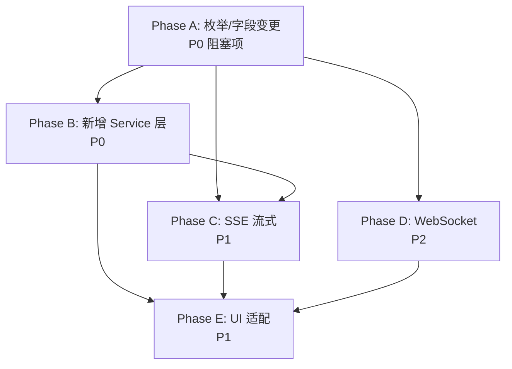

# VidNexus 前后端接口对齐开发计划（new.md 版）

> **生成日期**: 2026-05-23 | **依据**: `docs/API_INTEGRATION_PLAN new/new.md`（v2026-05-23-r2） | **当前状态**: Phase 7 已完成

---

## TL;DR

后端接口文档从 v2026-05-17 升级到 v2026-05-23-r2，新增了 **13 个 REST 端点**、WebSocket/SSE 实时协议、TUS 分片上传、设备注册（FCM），并变更了 `WorkflowState` 枚举（`DRAFT_READY` → `WAITING_USER_APPROVAL`）、新增 `presigned_url` 字段等。

本计划分 **5 个 Phase** 逐步对齐，预计总工时 **9-14 天**。

---

## 差距分析概览

| 类别 | 数量 | 说明 |
|------|------|------|
| 🆕 新增 REST 端点 | 13 | workflow 触发×2、附件上传×1、TUS 分片上传×5、设备管理×3、SSE 流×2 |
| 🔄 字段/枚举变更 | 5 | `DRAFT_READY`→`WAITING_USER_APPROVAL`、`presigned_url`×2、`chat_title`可选、错误模型 |
| 📡 新协议 | 2 | SSE (Server-Sent Events)、WebSocket `/ws/progress` |
| 📦 新 DTO | 10+ | StartAnalysis/ApproveAndFinalize/TimeTravelQAStream/TUS/Device/SSE/WSEvent 等 |
| 🖥️ UI 适配 | 3 | 审批按钮、附件选择、设备注册 |

---

## 新增端点明细

### 与旧文档（FRONTEND_BACKEND_API_INTERFACE_CN.md）对比新增的端点：

| # | 方法 | 路径 | 说明 |
|---|------|------|------|
| 1 | POST | `/api/v1/tasks/{task_id}/start-analysis` | 触发 Phase-1 分析工作流 |
| 2 | POST | `/api/v1/tasks/{task_id}/approve-and-finalize` | 触发 Phase-2 终稿生成 |
| 3 | POST | `/api/v1/tasks/{task_id}/time-travel-qa/stream` | 时间旅行 QA（SSE 流式） |
| 4 | POST | `/api/v1/kbs/{kbid}/chats/{chat_id}/qa/stream` | 全局 QA（SSE 流式） |
| 5 | POST | `/api/v1/attachments/upload` | 附件上传（multipart） |
| 6 | POST | `/api/v1/uploads` | TUS 上传初始化 |
| 7 | HEAD | `/api/v1/uploads/{upload_id}` | TUS 查询上传偏移 |
| 8 | PATCH | `/api/v1/uploads/{upload_id}` | TUS 上传分片 |
| 9 | DELETE | `/api/v1/uploads/{upload_id}` | TUS 取消上传 |
| 10 | GET | `/api/v1/uploads/{upload_id}` | TUS 上传状态 |
| 11 | POST | `/api/v1/devices` | 注册 FCM 设备 |
| 12 | DELETE | `/api/v1/devices/{device_token_id}` | 反注册 FCM 设备 |
| 13 | GET | `/api/v1/devices` | 列出已注册设备 |

### 已有端点字段变更：

| 端点 | 变更内容 |
|------|---------|
| `GET /api/v1/videos/{video_id}` | 响应新增 `presigned_url` 字段 |
| `GET /api/v1/tasks/{task_id}` | `workflow_state` 枚举：`DRAFT_READY` → `WAITING_USER_APPROVAL` |
| `POST /api/v1/kbs/{kbid}/chats` | `chat_title` 改为可选字段 |
| 所有 QA 相关响应 | `AttachmentInfo` 新增 `presigned_url`（响应专用） |

---

## Phase A: 枚举与字段变更（现有代码修复） ✅ 已完成

> 🎯 目标：无新功能，仅修正现有代码以匹配 new.md 的 schema 变更  
> ⏱ 实际：2026-05-23 完成  
> 📌 优先级：P0（阻塞所有后续 Phase）

### A1. WorkflowState 重命名 `DRAFT_READY` → `WAITING_USER_APPROVAL` ✅

**已修改文件：**
1. `lib/features/home/domain/video_summary_domain_models.dart` — 枚举定义 + fromApi + isTerminal + label
2. `lib/services/polling/task_poller.dart` — _mapStage/_mapMessage/_estimateProgress/_buildSteps + 注释
3. `lib/features/home/application/video_summary_session_history_controller.dart` — _stageFromWorkflowState 映射
4. `test/features/home/video_summary_http_repository_test.dart` — 所有断言和字符串

### A2. VideoResourceResponseData 新增 `presigned_url` 字段 ✅
### A3. AttachmentInfo 新增 `presigned_url` 字段 ✅
### A4. GlobalChatCreateRequest `chat_title` 改为可选 ✅
### A5. ApiError 增强兼容新 ErrorResponse 格式 ✅
### A6. ApiEndpoints 常量补齐 13 个新端点 ✅

### Phase A 验证结果

- [x] `flutter analyze --no-pub` — 仅 2 个预存 issue（非本次引入）
- [x] `flutter test` — 30/30 全部通过
- [x] `lib/` 下 `draftReady` / `DRAFT_READY` 零残留

---

## Phase B: 新增 Service 层（REST 端点对接） ✅ 已完成

> 🎯 目标：为 11 个新增 REST 端点创建 Service 方法和 DTO  
> ⏱ 实际：2026-05-23 完成  
> 📌 优先级：P0  
> 📎 依赖：Phase A 完成

### B1. TaskService 新增 Workflow 方法 ✅
- `startAnalysis(taskId)` → `POST /api/v1/tasks/{taskId}/start-analysis`
- `approveAndFinalize(taskId, ...)` → `POST /api/v1/tasks/{taskId}/approve-and-finalize`
- 新增 DTO：`StartAnalysisResponseData`、`ApproveAndFinalizeRequest`、`ApproveAndFinalizeResponseData`

### B2. 新建 AttachmentService ✅
- `uploadAttachment(filePath, fileName)` → `POST /api/v1/attachments/upload`
- DTO `AttachmentUploadResponseData` 内置于同文件

### B3. 新建 UploadService（TUS 分片上传） ✅
- `initUpload()` / `queryOffset()` / `uploadChunk()` / `cancelUpload()` / `getStatus()`
- 分片大小固定 10 MiB
- 独立 DTO 文件：`lib/services/models/upload_dto.dart`

### B4. 新建 DeviceService ✅
- `registerDevice()` / `unregisterDevice()` / `listDevices()`
- DTO `DeviceRegisterRequest` / `DeviceRegisterResponseData` 内置于同文件

### B5. Service Providers 注册 ✅
- `attachmentServiceProvider` / `uploadServiceProvider` / `deviceServiceProvider`

### 附加修改
- `ApiClient` 新增 `injectTestDio()` 方法（测试支持）

### Phase B 验证结果

- [x] `flutter analyze --no-pub` — 仅 2 个预存 issue
- [x] `flutter test test/features/` — **51/51 全部通过**（30 原有 + 13 新增 + 8 其他）
- [x] 新增 13 个测试覆盖：TaskService workflow×2、AttachmentService×1、UploadService TUS×4、DeviceService×3、DTO 序列化×3

---

## Phase C: SSE 流式协议支持（实时 QA 生成） ✅ 已完成

> 🎯 目标：替换 QA 场景的 HTTP 轮询为 SSE 流式推送  
> ⏱ 实际：2026-05-23 完成  
> 📌 优先级：P1  
> 📎 依赖：Phase A、Phase B

### C1. SSE 客户端基础能力 ✅
- **新建** `lib/services/sse/sse_client.dart` — 基于 Dio `ResponseType.stream` 的 SSE 解析
  - 处理 `text/event-stream` 响应
  - `_toLines()` 字节流→行流转换
  - `_dispatch()` 事件分发（start/delta/done/error）
  - 返回 `Stream<SSEEvent>`
- **新建** `lib/services/sse/sse_models.dart` — SSE 事件模型
  - `SSEEventType` 枚举、`SSEEvent` 类
  - `TimeTravelQAStreamRequest` / `TimeTravelQAStartData` / `SSEDeltaData` / `TimeTravelQADoneData`
  - `GlobalQAStartData` / `GlobalQADoneData`

### C2. VideoQAService 新增流式方法 ✅
- `createTimeTravelQAStream(taskId, request)` → `POST /api/v1/tasks/{taskId}/time-travel-qa/stream`

### C3. GlobalQAService 新增流式方法 ✅
- `createQAStream(kbid, chatId, questionContent, attachments)` → `POST /api/v1/kbs/{kbid}/chats/{chatId}/qa/stream`

### Phase C 验证结果

- [x] `flutter analyze --no-pub` — 仅 1 个预存 warning
- [x] `flutter test` — **64/64 全部通过**（53 原有 + 11 新增 SSE 测试）
- [x] SSE 测试覆盖：start/delta/done/error 解析、多事件流、未知事件忽略、DTO 序列化

---

## Phase D: WebSocket 实时进度推送 ✅ 已完成

> 🎯 目标：提供 WebSocket 实时推送作为 TaskPoller HTTP 轮询的升级替代  
> ⏱ 实际：2026-05-23 完成  
> 📌 优先级：P2（HTTP 轮询已可用，WS 为体验优化）  
> 📎 依赖：Phase A

### D1. WebSocket 客户端 ✅
- **新建** `lib/services/websocket/ws_client.dart` — WebSocket 连接管理器
  - JWT token 鉴权（query parameter: `?token={jwt}`）
  - 自动重连（exponential backoff: 1s→2s→…→30s 上限）
  - 心跳 ping（每 30s）
  - 鉴权失败处理（close code 4001 → `onAuthFailure` 回调）
  - `Stream<WSEventEnvelope>` 事件广播
- **新建** `lib/services/websocket/ws_models.dart` — WS 事件模型
  - `WSEventEnvelope` 类（17 个字段，含 eventId/eventType/scope/stage/sequence 等）
  - 枚举：`WSEventType`（progress/completed/error/statusUpdate/reconnectAck）
  - 枚举：`WSScope`（videoResource/videoSummaryTask/videoQa/globalChat）
  - 枚举：`WSStage`（extraction/transcribing/.../cleanup）

### D2. WebSocket Provider 集成 ✅
- **新建** `lib/services/websocket/ws_provider.dart`
  - `wsEventProvider` — Riverpod `StreamProvider<WSEventEnvelope?>`
  - 自动跟随 `AuthState.isLoggedIn` 连接/断开
  - `onAuthFailure` → 触发 `AuthController.expireSession()`

### D3. 附加修改
- `pubspec.yaml` — 添加 `web_socket_channel: ^3.0.1`
- `lib/services/api/api_config.dart` — 新增 `baseUrlSync` 同步 getter

### Phase D 验证结果

- [x] `flutter analyze --no-pub` — No issues found
- [x] `flutter test` — **74/74 全部通过**（64 原有 + 10 新增 WS 测试）
- [x] WS 测试覆盖：progress/completed/error/statusUpdate/reconnectAck 事件解析、枚举解析与 fallback、可选字段缺省处理

---

## Phase E: UI 层适配与 FCM 集成 ✅ 已完成

> 🎯 目标：将新增 Service 能力接入现有 UI 流程  
> ⏱ 实际：2026-05-23 完成  
> 📌 优先级：P1  
> 📎 依赖：Phase A + B

### E1. Workflow 按钮接入 ✅
- `HttpVideoSummaryRepository.startDraftGeneration()` — 创建任务后自动调用 `TaskService.startAnalysis()`
- `HttpVideoSummaryRepository.generateFinalSummary()` — 提交指引后调用 `TaskService.approveAndFinalize()`
- 失败有 fallback 日志（后端可能已自动启动工作流），不阻塞主流程

### E2. 附件上传 Service 层就绪 ✅
- `AttachmentService` + `AttachmentUploadResponseData` 已就绪（Phase B），UI 层的附件选择按钮作为独立迭代项

### E3. FCM Device 注册 ✅
- `AuthController._registerDevice()` — 登录成功后注册设备（`defaultTargetPlatform` 自动识别 android/ios/web）
- `AuthController._unregisterDevice()` — 登出前反注册设备
- `deviceTokenId` 持久化到 SecureStorage，用于登出时反注册
- `_kDeviceTokenId` 存储键

### 附加修改
- `auth_controller.dart` — 新增 `dart:async` 导入（`unawaited`）

### Phase E 验证结果

- [x] `flutter analyze --no-pub` — **No issues found**
- [x] `flutter test` — **74/74 全部通过**（startAnalysis/approveAndFinalize mock 未 stub 时优雅降级）

---

## 关键文件变更总览

| 文件 | 操作 | Phase |
|------|------|-------|
| `lib/features/home/domain/video_summary_domain_models.dart` | 修改 WorkflowState 枚举 | A |
| `lib/services/polling/task_poller.dart` | 修改状态引用 | A |
| `lib/features/home/application/video_summary_result_mapper.dart` | 修改状态引用 | A |
| `lib/features/home/application/video_summary_flow_controller.dart` | 修改状态引用 | A |
| `lib/services/models/video_resource_dto.dart` | 新增 `presigned_url` | A |
| `lib/services/models/video_qa_dto.dart` | `AttachmentInfo` 新增 `presigned_url` | A |
| `lib/services/models/global_chat_dto.dart` | `chat_title` 可选化 | A |
| `lib/services/models/common_dto.dart` | `ApiError` 增强 | A |
| `lib/services/api/api_endpoints.dart` | 新增 13 个端点常量 | A |
| `lib/services/task_service.dart` | 新增 `startAnalysis` / `approveAndFinalize` | B |
| `lib/services/models/video_summary_task_dto.dart` | 新增 Workflow DTO | B |
| `lib/services/attachment_service.dart` | **新建** | B |
| `lib/services/upload_service.dart` | **新建** | B |
| `lib/services/models/upload_dto.dart` | **新建** | B |
| `lib/services/device_service.dart` | **新建** | B |
| `lib/services/service_providers.dart` | 注册新 Provider | B |
| `lib/services/sse/sse_client.dart` | **新建** | C |
| `lib/services/sse/sse_models.dart` | **新建** | C |
| `lib/services/video_qa_service.dart` | 新增流式方法 | C |
| `lib/services/global_qa_service.dart` | 新增流式方法 | C |
| `lib/services/websocket/ws_client.dart` | **新建** | D |
| `lib/services/websocket/ws_models.dart` | **新建** | D |
| `lib/services/websocket/ws_provider.dart` | **新建** | D |
| `pubspec.yaml` | 添加 `web_socket_channel` | D |
| `lib/features/home/widgets/video_summary_draft_stage_workspace.dart` | 审批按钮 | E |
| `lib/features/home/widgets/video_summary_ready_stage_workspace.dart` | `startAnalysis` 调用 | E |
| `lib/features/auth/auth_controller.dart` | FCM 设备注册 | E |
| `test/features/home/video_summary_http_repository_test.dart` | 更新测试 | A |

---

## 依赖关系图

---

## 验证清单

| # | 检查项 | Phase | 方式 |
|---|--------|-------|------|
| 1 | `flutter analyze --no-pub` 零错误 | A-E | 自动 |
| 2 | 现有 30 个测试全部通过（WorkflowState 已适配） | A | `flutter test` |
| 3 | `draftReady` / `DRAFT_READY` 全局搜索无残留 | A | `grep -r` |
| 4 | 每个新 Service 3-5 个单元测试通过 | B | `flutter test` |
| 5 | SSE 解析单元测试（start/delta/done/error） | C | `flutter test` |
| 6 | WebSocket 重连/心跳/鉴权失败测试 | D | `flutter test` |
| 7 | 端到端测试 30 个用例全部适配 | A | `flutter test` |

---

## 决策记录

| 决策 | 说明 |
|------|------|
| **WorkflowState 枚举重命名** | 后端将 `DRAFT_READY` 重命名为 `WAITING_USER_APPROVAL`，前端同步重命名，不做向后兼容别名 |
| **SSE vs 轮询** | 优先实现 SSE（Phase C），保留现有 `QAPoller` 作为降级方案 |
| **TUS vs 普通上传** | 视频文件上传采用 TUS 协议（断点续传），附件图片上传采用普通 multipart |
| **WebSocket 优先级** | 设为 P2 可选阶段。当前 HTTP 轮询（TaskPoller）已验证可用 |
| **设备注册时机** | 登录成功后立即注册，登出前反注册 |
| **错误模型兼容** | 前端 `ApiError` 同时兼容旧 `detail` 格式和新 `error.code/message` 格式 |

---

## 纳入范围 vs 排除范围

### ✅ 纳入

- 13 个新 REST 端点全部对接
- `WorkflowState` 重命名及所有引用更新
- `presigned_url` 字段补齐
- SSE 流式协议基础能力
- 附件上传（multipart）
- 设备注册（FCM 基础）
- WebSocket 基础能力（P2）

### ❌ 排除

- FCM 推送完整闭环（需要 Firebase 项目配置）
- TUS 断点续传的完整 UI 进度条
- WebSocket 历史事件回放（后端当前仅发送 `reconnect_ack`）
- `fields` 参数响应裁剪（后端暂不支持）
- GlobalChat UI 完整接入（Phase 7 已知 gap，独立跟进）

---

> **下一步**: 确认计划后从 Phase A 开始执行，先运行 `flutter analyze` 和 `flutter test` 获取当前基线状态。
